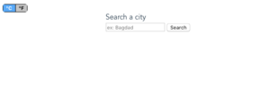
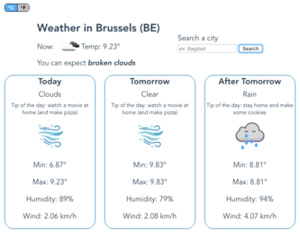
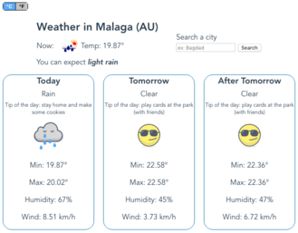
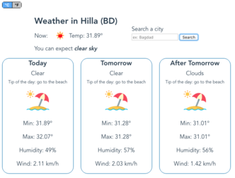

Our first Meteo App
=================================

Group project of [Mennito Caterina](https://github.com/caterinamennito) and [Ismail Joseph](https://github.com/Fesouille).
----------------------------------

*Exercice realized as a group project for the formation [BeCode](https://www.becode.org/) to be a Web Developper (Brussels, Belgium)*

* Project:

	* We have to realize a Meteo application based on the [Weather API](https://openweathermap.org/api) that gives weather forecasts for the coming days.
	* The app must be built with Vue.js Cli. 
	* Moreover, in order to simulate a client project, we have to realize a mockup of the app with [Figma](https://www.figma.com/file/BbhLVl89FcFxnEIHAw5wmN/Meteo?node-id=0%3A1).

* Content:
	* Vue.js CLI: all the application is built with Vue.js CLI.
	* [Weather API](https://openweathermap.org/api): to retrieve weather forecasts.
	* Mockup with [Figma](https://www.figma.com/file/BbhLVl89FcFxnEIHAw5wmN/Meteo?node-id=0%3A1).
	* Bonus: 
		* based on the temperature and the sky state (Clear, Rain or Clouds), the app gives some tips of things to do with an appropriate icon. In addition, the background of the app displays an image corresponding to the current weather.
		* button to select the temperature type (you can choose between C° and F°).

* Try it out! :
	* [Our first Meteo App](https://fesouille.github.io/MeteoApp/)

* A few illustrating pictures:

